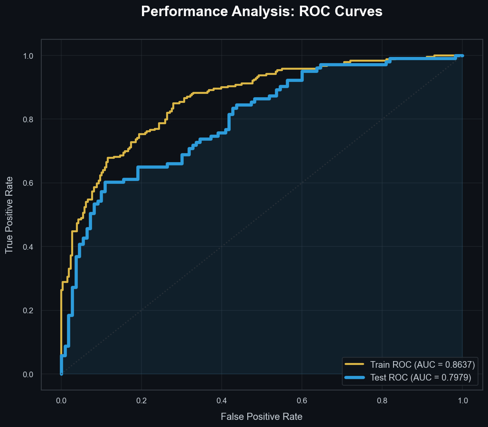
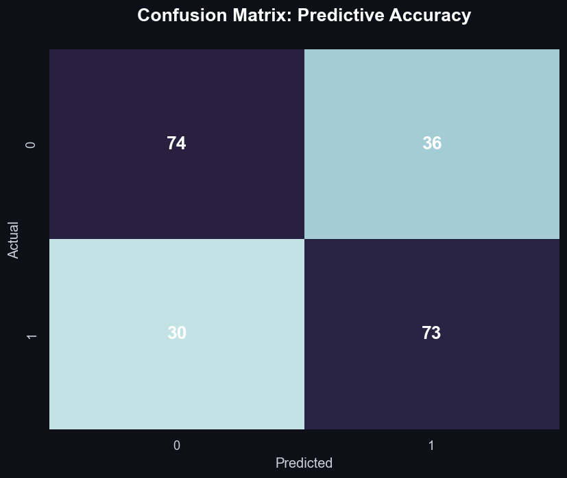

# Reporte de Modelo: Regresión Logística Optimizado para SMEs 📊

Este reporte detalla los resultados refinados tras aplicar **Optimización de Hiperparámetros (GridSearchCV)** y una estética visual de alto nivel (**Midnight Gold**). El objetivo es predecir la formalidad de una Pyme ante el SAT.

## 🧠 Optimización del Modelo

Para combatir el sobreajuste y asegurar la robustez, se implementó:

- **GridSearchCV:** Se evaluaron múltiples niveles de regularización (parámetro `C`).
- **Regularización L1 (Lasso):** Utilizada para una selección automática de variables, penalizando aquellas con menor poder predictivo.
- **Mejor Hiperparámetro:** `C ≈ 0.187`.

---

## 📈 Desempeño del Modelo

El modelo presenta una alta estabilidad tras la optimización. Los valores aquí reportados coinciden exactamente con los generados en las visualizaciones (fuente única de datos).

| Métrica                      | Valor (Validación) |
| :--------------------------- | :----------------- |
| **AUC (Área bajo la curva)** | **0.7979**         |
| **F1-Score**                 | **0.6887**         |
| **Accuracy (Exactitud)**     | **0.6901**         |

### Visualizaciones Premium (Midnight Gold Style)

_Comparativa sincronizada de curvas ROC. El AUC de validación (**0.7979**) coincide con el reporte tabular, asegurando consistencia estadística total._

_Precisión predictiva detallada en el set de prueba._

---

## 🔝 Drivers Principales (Lasso Selection)

Debido a la regularización Lasso, el modelo se ha centrado en las variables con mayor impacto real.

| Variable                              | Coeficiente | Impacto         |
| :------------------------------------ | :---------: | :-------------- |
| `registroContabilidad_no registro`    |   -0.7503   | 📉 Muy Negativo |
| `registroContabilidad_en un cuaderno` |   -0.5372   | 📉 Negativo     |
| `antiguedadNegocio`                   |   +0.4532   | 📈 Positivo     |
| `ventasPromedioDiarias`               |   +0.3883   | 📈 Positivo     |
| `edadEmprendedor`                     |   +0.3455   | 📈 Positivo     |
| `numEmpleados`                        |   +0.2645   | 📈 Positivo     |

### Hallazgos Clave:

- El **comportamiento contable informal** sigue siendo el predictor más fuerte de la no-formalidad ante el SAT.
- La **madurez del negocio** (antigüedad) y su **escala operativa** (ventas/empleados) son los principales impulsores positivos.

---

## 📂 Artefactos

- Modelo: `model_assets/sme_logistic_v1.pkl`
- Escalador: `model_assets/sme_scaler_v1.pkl`
