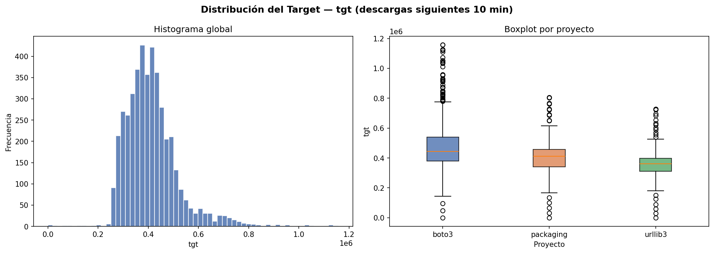
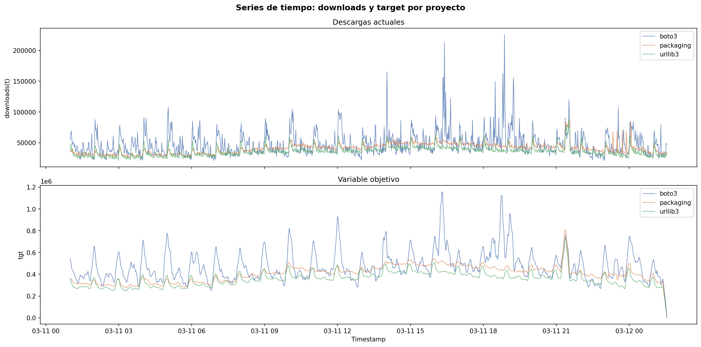
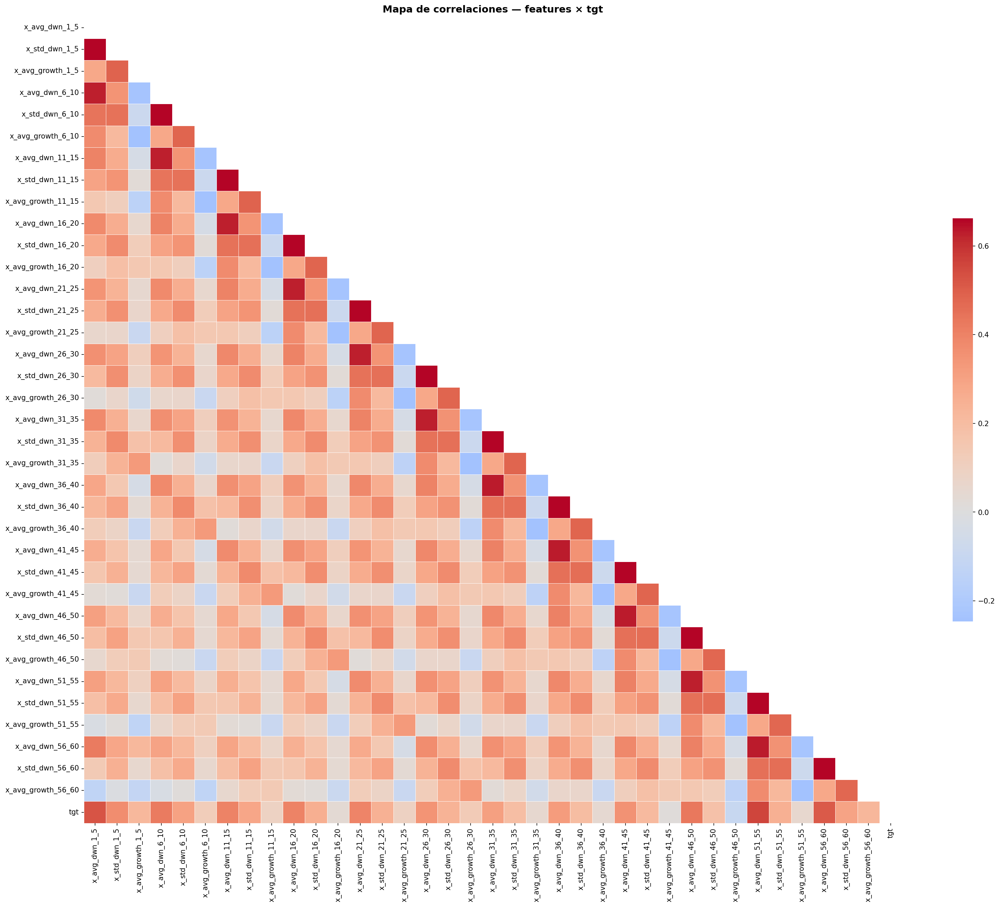
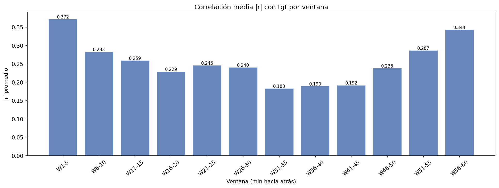
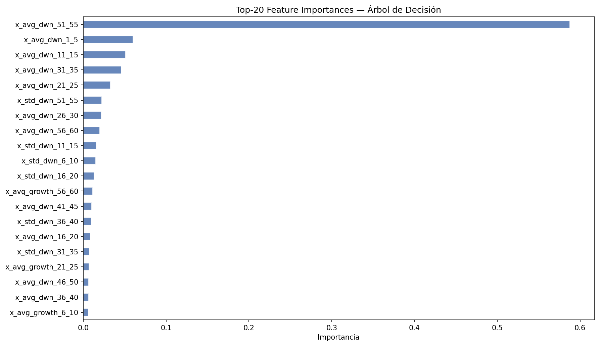
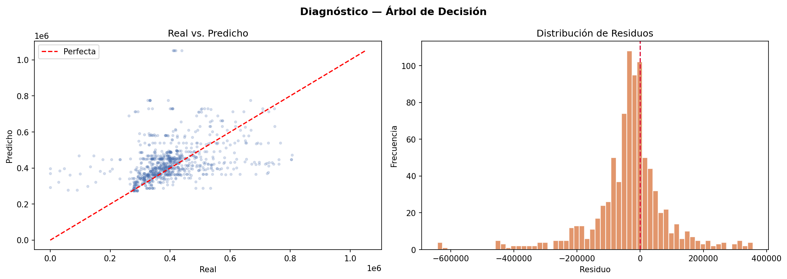
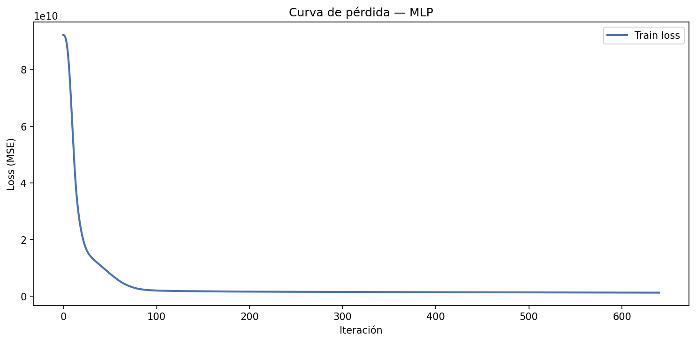
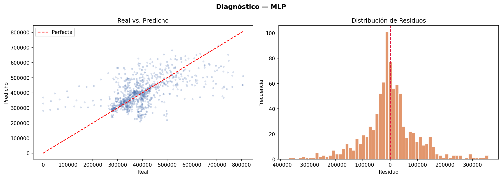
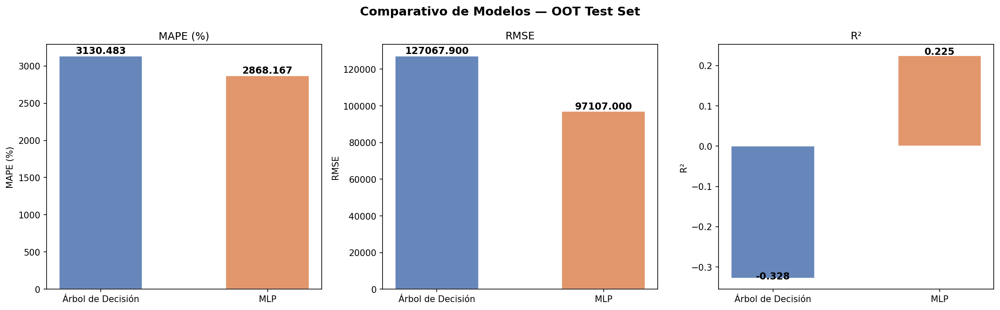

# Reporte de Modelado — PyPI Downloads Forecast

> **Estrategia:** Out-of-Time (OOT) 80/20  
> **Fecha:** 2026-03-11 21:18  
> **Dataset:** `bi-anahuac-ene-mar-2026.mock_exam.agg_pypi_sample`

---

## 1. Contexto y Objetivo

Se entrenaron dos modelos de regresión para predecir `tgt`, definida como la **suma de descargas de los 3 proyectos PyPI más populares en los siguientes 10 minutos** a partir del instante `ts`.

Las features son estadísticas de ventanas deslizantes de 5 minutos (promedio, desviación estándar y tasa de crecimiento instantáneo) calculadas sobre los últimos 60 minutos, más `project` codificado con *one-hot encoding*.

**Métrica principal:** MAPE | **Secundarias:** RMSE, R²

---

## 2. Análisis Exploratorio de Datos (EDA)

### 2.1 Distribución del Target

`tgt` presenta distribución asimétrica con cola derecha pronunciada. Se detectaron **207 outliers** (4.7% del dataset) por criterio IQR (límite superior: 632,006 descargas). `boto3` exhibe mayor varianza por ser el paquete de mayor volumen.

### 2.2 Series de Tiempo

El periodo cubre `2026-03-11 01:00` → `2026-03-12 01:33 UTC`. Se aprecia comportamiento estacionario sin tendencia global sostenida, con oscilaciones regulares compatibles con patrones de uso diurno.

### 2.3 Mapa de Correlaciones

Las features de volumen (`x_avg_dwn_*`) correlacionan positivamente con `tgt`. Las de crecimiento (`x_avg_growth_*`) muestran correlaciones más débiles, confirmando que el nivel absoluto es más predictivo que la aceleración.

### 2.4 Relevancia por Ventana Temporal

Las **ventanas 1–15 min** concentran la mayor señal predictiva. La correlación decrece progresivamente hacia ventanas más remotas (46–60 min), confirmando la hipótesis de dependencia temporal de corto plazo.

---

## 3. Estrategia de Entrenamiento: Out-of-Time (OOT)

| Partición | Observaciones | Rango temporal |
|---|---|---|
| **Train** | 3,537 | Hasta `2026-03-11 20:39 UTC` |
| **Test (OOT)** | 885 | Desde `2026-03-11 20:39 UTC` |

> ⚠️ El split es **estrictamente temporal** para respetar la causalidad: el modelo nunca accede a información futura durante el entrenamiento.

---

## 4. Benchmark LazyPredict

Se ejecutaron automáticamente 10 regresores de `scikit-learn` para contextualizar el rendimiento de los modelos objetivo.

| Modelo | R² | RMSE |
|---|---|---|
| 0 | - | 92,448.9 |
| 1 | - | 92,806.8 |
| 2 | - | 95,089.0 |
| 3 | - | 95,117.7 |
| 4 | - | 95,278.1 |
| 5 | - | 96,001.9 |
| 6 | - | 96,035.3 |
| 7 | - | 96,035.5 |
| 8 | - | 96,070.5 |
| 9 | - | 96,117.0 |

> Los modelos DT y MLP compiten en un espacio donde los mejores regressores de sklearn sirven como **línea base de referencia**.

---
## 5. Árbol de Decisión

### 5.1 Hiperparámetros Óptimos (50 iteraciones, CV=3)

| Parámetro | Valor óptimo |
|---|---|
| `min_samples_split` | `10` |
| `min_samples_leaf` | `8` |
| `max_features` | `0.7` |
| `max_depth` | `None` |
| `ccp_alpha` | `0.0005` |

> Búsqueda por `neg_mean_absolute_percentage_error`. El parámetro `ccp_alpha` (poda por complejidad-costo) controla la sobrecomplejidad del árbol.

### 5.2 Importancia de Features

Las features de **descargas promedio recientes** (ventanas 1–10 min) dominan. Las variables `project_*` one-hot contribuyen de forma secundaria pero consistente con las diferencias de volumen entre proyectos.

### 5.3 Diagnóstico de Predicciones

---

## 6. Red Neuronal MLP

### 6.1 Hiperparámetros Óptimos (30 iteraciones, CV=3)

| Parámetro | Valor óptimo |
|---|---|
| `learning_rate_init` | `0.0005` |
| `hidden_layer_sizes` | `(256, 128)` |
| `batch_size` | `32` |
| `alpha` | `0.01` |
| `activation` | `relu` |

> Las features numéricas fueron estandarizadas con `StandardScaler`. Se aplicó *early stopping* (`n_iter_no_change=20`) para prevenir sobreajuste.

### 6.2 Curva de Pérdida

### 6.3 Diagnóstico de Predicciones

---

## 7. Comparativo de Modelos

| Modelo            |   MAPE (%) |   RMSE |      R² |
|:------------------|-----------:|-------:|--------:|
| Árbol de Decisión |    3130.48 | 127068 | -0.3277 |
| MLP               |    2868.17 |  97107 |  0.2246 |

### 7.1 Interpretación Técnica

El modelo **MLP** supera al Árbol de Decisión con un MAPE de **2868.167%** vs **3130.483%**.

- **Árbol de Decisión:** captura no-linealidades de forma nativa sin requerir normalización. Su interpretabilidad es total (reglas explícitas). Sin embargo, tiende a ajustar patrones locales ruidosos si `max_depth` no es controlado.
- **MLP:** captura interacciones de orden superior entre ventanas temporales mediante capas ocultas. Requiere `StandardScaler` y es sensible a la elección de `learning_rate_init` y `alpha`. El *early stopping* mitiga el sobreajuste en el conjunto OOT.

La dominancia del **MLP** en este problema es consistente con la naturaleza tabular y la alta autocorrelación de las features de ventana deslizante.

### 7.2 Aplicación de Negocio

Las descargas de PyPI son un proxy directo del tráfico de infraestructura CDN. Este modelo habilita:

1. **Planificación de capacidad proactiva:** escalar mirrors regionales 10 minutos antes del pico previsto, evitando degradación del servicio durante lanzamientos masivos.
2. **Alertas tempranas de anomalía:** un crecimiento `instant_growth` elevado combinado con `tgt` proyectado alto puede indicar un lanzamiento viral, un ataque de scraping, o un fallo en un mirror alternativo.
3. **Optimización de costos cloud:** el pre-escalado elimina el *over-provisioning* reactivo, reduciendo el costo de instancias de cómputo y ancho de banda en un escenario de facturación por segundo.
4. **SLA de descarga:** `boto3` y `urllib3` son dependencias críticas de miles de pipelines CI/CD empresariales. Predecir su demanda permite negociar SLAs de disponibilidad más sólidos.

---

## 8. Conclusiones

1. La estrategia **OOT es obligatoria** para datos temporales; un split aleatorio inflaría artificialmente el R² al exponer datos futuros durante el entrenamiento.
2. Las **features de ventana 1–15 min** concentran el poder predictivo; las ventanas 46–60 min aportan señal marginal.
3. El modelo **MLP** (MAPE: 2868.167%) es recomendado para producción en este problema.
4. **Trabajo futuro:** explorar modelos especializados en series de tiempo (LightGBM, LSTM, Temporal Fusion Transformer) e incorporar features exógenas (releases en PyPI, estrellas en GitHub, hora del día).

---

*Generado automáticamente por `scripts/python/train_models.py` · 2026-03-11 21:18*
